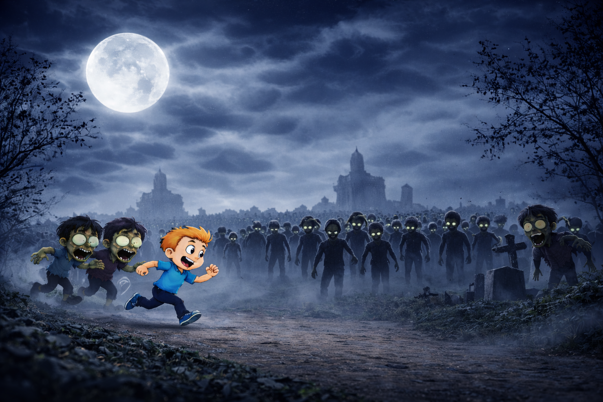

<p align="center">
  
</p>

<h1 align="center">🧟 Zombie Survival Game</h1>

<p align="center">
  <b>A Lode Runner–inspired 2D platformer built in modern C++ with SFML 3.0</b>
</p>

<p align="center">
  
  
  
  
</p>

---

## 📖 About

**Zombie Survival Game** is a classic platformer where you play as a survivor navigating through zombie-infested levels. Collect all the coins, avoid (or outsmart) the enemies, climb ladders, swing across poles, and dig through floors to escape — all before time runs out!

Built as an OOP project, this game demonstrates solid software engineering principles using **polymorphism, inheritance hierarchies, double-dispatch collision handling**, and a clean **component-based architecture**.

---

## 🎮 How to Play

| Action | Key |
|---|---|
| **Move Left / Right** | `←` `→` Arrow Keys |
| **Climb Up / Down** | `↑` `↓` Arrow Keys |
| **Jump** | `Spacebar` |
| **Dig Left** | `Z` |
| **Dig Right** | `X` |
| **Mute / Unmute** | `M` |

### 🎯 Objective
- **Collect all coins** in each level to advance to the next stage.
- **Avoid zombies** — getting caught costs you a life! (You get brief invincibility after being hit.)
- **Beat the clock** — each level has a time limit. If time runs out, you lose a life and restart the level.
- Complete all **3 levels** to win the game!

### 💡 Tips
- Use **ladders** (`H`) to move between platforms vertically.
- **Poles** (`-`) let you cross gaps horizontally — you'll hang and slide across.
- **Dig floors** (`^`) to create traps or open new paths. Digged floors regenerate after a short time.
- Enemies switch to **chase mode** when you're nearby — use the level layout to your advantage!

---

## 🏗️ Architecture & Design

The project follows a clean **Object-Oriented** architecture:

```
                        ┌───────────┐
                        │  Collider  │  (Interface - Double Dispatch)
                        └─────┬─────┘
                              │
                        ┌─────┴─────┐
                        │ GameObject │  (Abstract Base)
                        └─────┬─────┘
               ┌──────────────┼──────────────────┐
               │              │                  │
        ┌──────┴──────┐  ┌───┴────┐    ┌────────┴────────┐
        │ MovingObject │  │  Wall  │    │    BaseFloor     │
        │  (Abstract)  │  └────────┘    └───────┬─────────┘
        └──────┬───────┘                ┌───────┼────────┐
        ┌──────┴──────┐                 │       │        │
   ┌────┴───┐   ┌────┴────┐        Floor  Diggable  Ladder/Pole/Coin
   │ Player │   │  Enemy  │                Floor
   └────────┘   └─────────┘
```

### Key Design Patterns
| Pattern | Usage |
|---|---|
| **Double Dispatch** | Collision resolution between any two game objects without `dynamic_cast` chains |
| **Inheritance & Polymorphism** | Shared behavior in `GameObject` / `MovingObject` base classes |
| **Component Architecture** | `GameController` orchestrates `Board`, `Menu`, `HUD`, and `Player` |
| **Resource Manager** | Centralized loading and caching of textures, fonts, and sounds |
| **State Machine** | Game states: `Menu → Help → Playing → Victory / GameOver / TimeUp` |

---

## 📁 Project Structure

```
├── include/               # Header files
│   ├── Board.h            # Level management & collision detection
│   ├── Collider.h         # Double-dispatch collision interface
│   ├── Constants.h        # Game-wide constants & configuration
│   ├── Enemy.h            # Enemy AI (Patrol / Chase states)
│   ├── GameController.h   # Main game loop & state management
│   ├── GameObject.h       # Abstract base class for all entities
│   ├── Hud.h              # Heads-Up Display (score, lives, timer)
│   ├── LevelLoader.h      # File-based level parsing
│   ├── Menu.h             # Main menu & help screen
│   ├── MovingObject.h     # Physics & movement (gravity, velocity)
│   ├── Player.h           # Player logic, input, & sound effects
│   ├── ResourceManager.h  # Centralized resource caching
│   └── StaticObject.h     # Wall, Floor, Ladder, Pole, Coin
│
├── src/                   # Implementation files (.cpp)
├── resources/
│   ├── Board.txt          # Level layouts (3 levels)
│   ├── textures/          # Sprite sheets & backgrounds
│   ├── sounds/            # Sound effects & music
│   └── fonts/             # Custom horror-themed fonts
│
├── cmake/                 # CMake build configuration
├── CMakeLists.txt         # Main build script
└── README.md              # You are here!
```

---

## ⚙️ Build & Run

### Prerequisites
- **C++17** compatible compiler (MSVC / GCC / Clang)
- **CMake** 3.26+
- **SFML 3.0** — [Download here](https://www.sfml-dev.org/download.php)

### Build Steps

```bash
# 1. Clone the repository
git clone https://github.com/ofekre/Zombie-Survival-Game.git
cd Zombie-Survival-Game

# 2. Configure SFML path in CMakeLists.txt (if needed)
#    Update SFML_LOCATION to your SFML installation path

# 3. Build with CMake
cmake --preset x64-Debug
cmake --build out/build/x64-Debug

# 4. Run the game
./out/build/x64-Debug/oop1_project.exe
```

> **Note:** Make sure the `resources/` folder is accessible from the executable's working directory.

---

## 🕹️ Game Features

- 🗺️ **3 Handcrafted Levels** — Progressively harder with unique layouts
- 🧟 **Smart Enemy AI** — Patrol mode + chase mode when player is nearby
- 🪜 **Ladders & Poles** — Vertical & horizontal traversal mechanics
- ⛏️ **Diggable Floors** — Dig through floors to create paths or trap enemies
- 💰 **Coin Collection** — Score multiplied by current level number
- ⏱️ **Time Pressure** — Each level has a countdown timer
- ❤️ **Lives System** — 3 lives with invincibility frames after getting hit
- 🔊 **Full Sound Design** — Background music, sound effects, and mute toggle
- 🎨 **Custom Art & Fonts** — Horror-themed aesthetic throughout

---

## 🗺️ Level Map Legend

| Symbol | Object |
|:---:|---|
| `@` | Player spawn |
| `%` | Zombie enemy |
| `*` | Coin |
| `#` | Wall (solid) |
| `^` | Diggable floor |
| `H` | Ladder |
| `-` | Pole (horizontal bar) |

---

## 👨‍💻 Authors

| Name | Role |
|---|---|
| **Ofek Revach** | Developer |
| **Avia Asulin** | Developer |

*Object-Oriented Programming project*

---

<p align="center">
  <sub>Built with ❤️ using C++ and SFML</sub>
</p>
